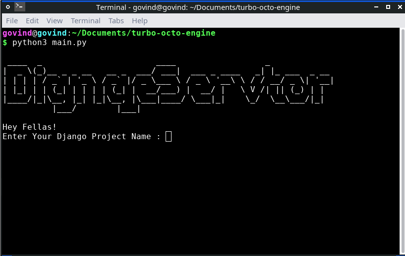

# Django Servator

Hey Guys! It's Govind here. 
Have you ever realised how tedious is it to setup your *initial Django project* ?
Now, the wait is over.....
Meet Django Servator!! 


## Tech Stacks

-Pure Python
-Yes, only Python 🗿🗿

## Working

1. Download the script `main.py` from github. 

```
git clone https://github.com/govindrkumar/turbo-octo-engine.git
cd 'turbo-octo-engine'

```
*Or, you can directly visit my repo link and download `main.py`. Directly!*

2. Run it through powershell/cmd.
```
python3 main.py

```


3. Now, Enter your project name, app name. 

**Sit back! Relax, and let the script do his work.**

4. Open your code editor and open the project folder and start your damn work. 


## Future Scope :

I am working on creating a py-qt gui for every platform. 

Thank you for keeping up with me in this explanation. 
Hope you liked it!


## Contribution
No one helps single man 🥺😢😭

Commit a PR and help me out grow features in this project. 


## License
See the `LICENSE` file for license information.
It is released under `Clause 3 BSD license`. So, I would request to all of you to push as much as commit you can and make our fellow developers work easier.


## One Last thing 
If you really read this....


Bye, Bye! Love you all!! 😘


